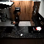
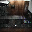
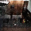
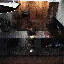

# Generating Videos with Scene Dynamics

## Introduction
This repository contains an implementation of "Generating Videos with Scene Dynamics" in Tensorflow. The paper can be found here (http://carlvondrick.com/tinyvideo/paper.pdf). The model learns to generate a video by upsampling from some latent space, using adversarial training.

## Requirements
For running this code and reproducing the results, you need the following packages. Python 2.7 has been used.

Packages:
* TensorFlow
* NumPy
* cv2
* scikit-video
* scikit-image

## VideoGAN - Architecture and Working
Attached below is the architecture used in the paper [paper](http://carlvondrick.com/tinyvideo/paper.pdf). 

## Usage  
Place the videos inside a folder called "trainvideos". 
Run main.py with the required values for each flag variable.

## Results
Below are some of the results on the model trained on MPII Cooking Activities dataset. 
<table><tr><td>
<strong>Real videos</strong> 

 

 

</td><td>
<strong>Generated videos</strong> 

 

 

</td></tr></table>

## Acknowledgements
* [Generating Videos With Scene Dynamics](http://carlvondrick.com/tinyvideo/paper.pdf) - Carl Vondrick et al.

